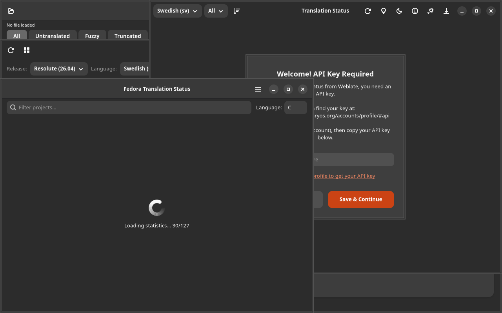

# TTS Tester

[](https://github.com/yeager/tts-tester/releases)
[](https://www.gnu.org/licenses/gpl-3.0)
[](https://www.transifex.com/danielnylander/tts-tester/)

Text-to-speech engine comparison tool — GTK4/Adwaita.



## Features

- **Engine comparison** — test espeak-ng, piper, festival side by side
- **Language support** — select from available voices and languages
- **Speed/pitch control** — adjust synthesis parameters
- **Audio playback** — instant preview of TTS output
- **Text presets** — common test phrases for quick testing
- **Dark/light theme** toggle

## Installation

### Debian/Ubuntu

```bash
echo "deb [signed-by=/usr/share/keyrings/yeager-keyring.gpg] https://yeager.github.io/debian-repo stable main" | sudo tee /etc/apt/sources.list.d/yeager.list
curl -fsSL https://yeager.github.io/debian-repo/yeager-keyring.gpg | sudo tee /usr/share/keyrings/yeager-keyring.gpg > /dev/null
sudo apt update && sudo apt install tts-tester
```

### Fedora/openSUSE

```bash
sudo dnf config-manager --add-repo https://yeager.github.io/rpm-repo/yeager.repo
sudo dnf install tts-tester
```

### From source

```bash
git clone https://github.com/yeager/tts-tester.git
cd tts-tester && pip install -e .
tts-tester
```

## Translation

Help translate on [Transifex](https://www.transifex.com/danielnylander/tts-tester/).

## License

GPL-3.0-or-later — see [LICENSE](LICENSE) for details.

## Author

**Daniel Nylander** — [danielnylander.se](https://danielnylander.se)
